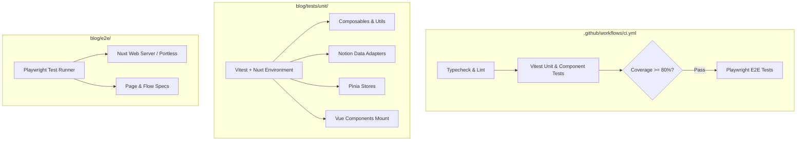

# Design: Adding Testing Suite for Blog Project

## Technical Approach
We will introduce a multi-tiered testing architecture to `blog` using **Vitest** (with `@nuxt/test-utils` and `@vue/test-utils`) for unit and component testing, and **Playwright** for end-to-end (E2E) testing. The Vitest setup will run inside the Nuxt runtime environment (`environment: 'nuxt'`) using `happy-dom` to support Nuxt auto-imports, Pinia stores, composables, and Vue component mounting. Playwright tests will mirror the configuration used across the Lascar monorepo (`tique`), supporting desktop and mobile viewports with Portless local resolution and automated CI execution.

---

## Architecture Decisions

### Decision: Vitest with `@nuxt/test-utils/config` & `happy-dom`
- **Choice**: Use `defineVitestConfig` from `@nuxt/test-utils/config` with `environment: 'nuxt'` and `happy-dom`.
- **Alternatives**: Plain Vitest with jsdom; Jest.
- **Rationale**: `@nuxt/test-utils` provides built-in context for Nuxt 4, handling auto-imports (`useUIStore`, `useRuntimeConfig`, `useFetch`, `ref`, etc.) seamlessly without complex mocking scaffolding. `happy-dom` provides fast DOM simulation.

### Decision: Code Coverage Standard (v8 at 80% Threshold)
- **Choice**: `@vitest/coverage-v8` enforcing >=80% threshold across lines, functions, branches, and statements.
- **Alternatives**: c8 / istanbul; no coverage thresholds.
- **Rationale**: Enforcing an 80% threshold ensures high reliability across critical adapters, composables, utils, and shared UI components.

### Decision: Playwright E2E Architecture Alignment
- **Choice**: Structure Playwright configuration under `blog/playwright.config.ts` targeting `blog/e2e/specs/`, matching `tique` standards (`http://blog.localhost:1355` / `PLAYWRIGHT_TEST_BASE_URL`).
- **Alternatives**: Cypress; Puppeteer.
- **Rationale**: Consistent tooling across the monorepo; fast, headless multi-browser execution with trace capture and CI retries.

---

## Data Flow



---

## File Changes

| File | Action | Description |
| :--- | :--- | :--- |
| `blog/package.json` | **Modify** | Add test dependencies (`vitest`, `@nuxt/test-utils`, `@vue/test-utils`, `happy-dom`, `@vitest/coverage-v8`, `@playwright/test`) and npm scripts (`test`, `test:watch`, `test:coverage`, `test:e2e`, `test:e2e:ui`). |
| `blog/vitest.config.ts` | **Create** | Configure Vitest with Nuxt environment, coverage thresholds (80%), and aliases. |
| `blog/playwright.config.ts` | **Create** | Configure Playwright with baseURL `http://blog.localhost:1355`, Desktop & Pixel 7 projects, and webServer. |
| `blog/tests/unit/composables/useApiBase.spec.ts` | **Create** | Unit test for `useApiBase` composable. |
| `blog/tests/unit/utils/fetch-handlers.spec.ts` | **Create** | Unit test for fetch error and response handlers. |
| `blog/tests/unit/adapters/*.spec.ts` | **Create** | Unit tests for `blockContentAdapter`, `blogAdapter`, and `linkAdapter`. |
| `blog/tests/unit/stores/useUIStore.spec.ts` | **Create** | Store state and action tests for UI store. |
| `blog/tests/unit/components/**/*.spec.ts` | **Create** | Component mount and interaction tests for `Markdown`, `Card`, `Navbar`, `SideNav`, `Footer`, `FilterOptions`, `Button`, `Grid`, `Heading`, `Pill`, `Modal`, `Loading`, `Logo`. |
| `blog/tests/unit/error.spec.ts` | **Create** | Unit test for `error.vue` handling and clearError triggers. |
| `blog/e2e/specs/*.spec.ts` | **Create** | Playwright E2E test specs for `navigation`, `home`, `about`, `blog`, `portfolio`, `social-share`, and `error-page`. |
| `.github/workflows/ci.yml` | **Create / Modify** | Add CI workflow executing typecheck, Vitest coverage gate, and Playwright E2E suites. |

---

## Interfaces / Contracts

### `blog/vitest.config.ts`
```typescript
import { defineVitestConfig } from '@nuxt/test-utils/config';

export default defineVitestConfig({
  test: {
    environment: 'nuxt',
    globals: true,
    coverage: {
      provider: 'v8',
      reporter: ['text', 'json', 'html'],
      thresholds: {
        lines: 80,
        functions: 80,
        branches: 80,
        statements: 80,
      },
      exclude: ['node_modules/**', '.nuxt/**', 'dist/**', 'e2e/**', '**/*.d.ts', 'playwright.config.ts', 'vitest.config.ts'],
    },
  },
});
```

### `blog/playwright.config.ts`
```typescript
import { defineConfig, devices } from '@playwright/test';

export default defineConfig({
  testDir: './e2e/specs',
  fullyParallel: true,
  forbidOnly: !!process.env.CI,
  retries: process.env.CI ? 2 : 0,
  workers: process.env.CI ? 1 : undefined,
  reporter: 'list',
  use: {
    baseURL: process.env.PLAYWRIGHT_TEST_BASE_URL || 'http://blog.localhost:1355',
    trace: 'on-first-retry',
    screenshot: 'only-on-failure',
  },
  projects: [
    {
      name: 'Desktop Chrome',
      use: { ...devices['Desktop Chrome'] },
    },
    {
      name: 'Mobile Chrome',
      use: { ...devices['Pixel 7'] },
    },
  ],
  webServer: process.env.CI
    ? {
        command: 'bun run preview',
        port: 3000,
        reuseExistingServer: false,
      }
    : undefined,
});
```

---

## Testing Strategy

| Layer | What to Test | Approach / Script |
| :--- | :--- | :--- |
| **Unit: Adapters & Utils** | Notion data transformation, error catching, URL formatting | `bun run test` (Vitest isolated unit execution) |
| **Unit: Stores & Composables** | Pinia state changes, `useApiBase` config resolution | `bun run test` with Nuxt runtime auto-imports |
| **Component Mount Tests** | UI rendering, props reactivity, event emission, slot rendering | `@vue/test-utils` mount via Vitest |
| **Coverage Verification** | Ensure overall test coverage is >= 80% | `bun run test:coverage` |
| **E2E Desktop & Mobile** | Page loads, route navigation, filter selection, social links | `bun run test:e2e` (Playwright Chromium & Pixel 7) |
| **CI Automation** | Automated PR gate validation | GitHub Actions workflow executing typecheck, coverage, and E2E |

---

## Migration / Rollout
1. **Install Test Dependencies**: Add packages to `blog/package.json` devDependencies.
2. **Setup Configurations**: Create `vitest.config.ts` and `playwright.config.ts`.
3. **Implement Unit & Component Tests**: Add specs across `blog/tests/unit/`.
4. **Implement Playwright E2E Tests**: Add specs across `blog/e2e/specs/`.
5. **Verify Coverage**: Run `bun run test:coverage` and adjust tests to ensure >=80% coverage.
6. **Configure CI Pipeline**: Create/update `.github/workflows/ci.yml` for automated validation.

---

## Open Questions
- None.
