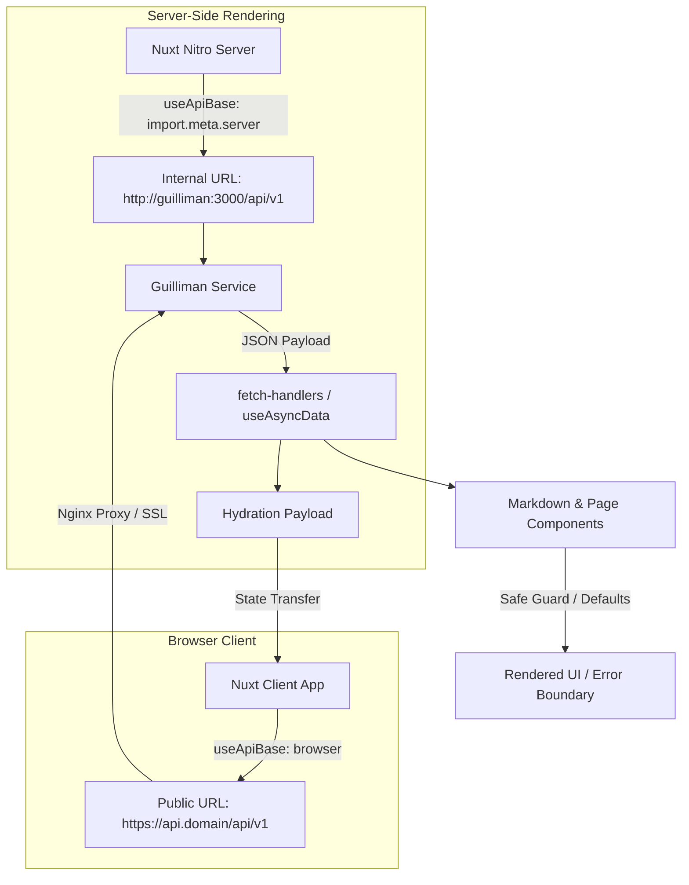

# Technical Design: Fix Production 500 Errors and Data Contracts in Blog

## Technical Approach
The Nuxt 4 `blog` application crashes with 500 errors in production Docker deployments due to:
1. **Hairpin NAT failure**: SSR attempts to query `https://${API_DOMINIO}/api/v1` which fails inside the container network.
2. **Data contract misalignment**: Pages expect response structures that differ from Guilliman's actual responses (e.g. `/about-me` returning `ContentBlock[]` directly vs `{ about: { content: ... } }`, `/links` returning `ILink[]` directly).
3. **Unprotected rendering**: Dereferencing `data.value!` during SSR/client transitions without fallback guards causes unhandled runtime exceptions.

We address these by implementing dual runtime configuration (Docker internal service discovery for SSR, public gateway for client), a unified `useApiBase()` composable, correcting component props and API handlers, and adding an `app/error.vue` boundary.

## Architecture Decisions

- **ADR-1: Dual Runtime Configuration**: Nuxt `runtimeConfig` defines `apiBaseUrl` (server-only internal URL `http://guilliman:3000/api/v1`) and `public.apiBaseUrl` (client public URL `https://${API_DOMINIO}/api/v1`).
- **ADR-2: Universal API Resolver (`useApiBase`)**: Composable uses `import.meta.server` to select the server-side internal Docker DNS endpoint during SSR, falling back to the public domain in browser execution.
- **ADR-3: Contract Normalization in Fetch Handlers**: Fetch handlers (`fetchAboutPage`, `fetchLinksPage`) normalize backend payloads to predictable schemas with typed interfaces.
- **ADR-4: Defensive Component Guards**: `Markdown/index.vue` sets default `content: () => []` and validates iterables; page components use safe computed properties instead of non-null assertions (`!`).
- **ADR-5: Root Error Page**: Deploy `blog/app/error.vue` handling HTTP 404/500 with `clearError()` to prevent unhandled white screens.

## Data Flow



## File Changes Table

| File | Change Type | Description |
|---|---|---|
| `docker-compose.yml` | Update | Set `NUXT_API_BASE_URL` and `NUXT_PUBLIC_API_BASE_URL` under `blog` service. |
| `blog/nuxt.config.ts` | Update | Add `apiBaseUrl` (private) and `public.apiBaseUrl` in `runtimeConfig`. |
| `blog/app/composables/useApiBase.ts` | Create | Export `useApiBase()` resolving server vs client base URL. |
| `blog/app/utils/fetch-handlers.ts` | Update | Update `fetchAboutPage` (`about: ContentBlock[]`), add `fetchLinksPage`, use `useApiBase`. |
| `blog/app/components/Markdown/index.vue` | Update | Add default prop `content: () => []` with defensive loop filtering. |
| `blog/app/pages/About/index.vue` | Update | Bind `<Markdown :content="data?.about || []" />` and guard `filteredSkills`. |
| `blog/app/pages/Social-Share/index.vue` | Update | Use `fetchLinksPage` / `useApiBase()`, map `ILink[]` directly. |
| `blog/app/pages/Blog/index.vue` | Update | Add optional chaining to `posts[0]` and `.slice(1)` rendering. |
| `blog/app/pages/Portfolio/index.vue` | Update | Guard `filteredProjects` with null checks on `data.value`. |
| `blog/app/error.vue` | Create | Root error page handling 404/500 with user-friendly recovery. |

## Interfaces & Contracts

```typescript
// blog/app/composables/useApiBase.ts
export const useApiBase = (): string => {
  const config = useRuntimeConfig();
  if (import.meta.server) {
    return config.apiBaseUrl || config.public.apiBaseUrl;
  }
  return config.public.apiBaseUrl;
};

// fetch-handlers.ts return contracts
export interface AboutPageData {
  about: ContentBlock[];
  skills: ISkill[];
  experiences: IExperience[];
}
```

## Testing Strategy

1. **Type & Build Verification**: Run `bun run check` and `bun run build` in `blog/` to ensure 0 TypeScript / Nuxt build errors.
2. **SSR Network Verification**: Verify SSR data fetching resolves `http://guilliman:3000/api/v1` inside Docker network.
3. **Hydration & Guard Validation**: Load `/about`, `/blog`, `/portfolio`, `/social-share` with empty, partial, and full API responses.
4. **Error Boundary Test**: Trigger deliberate 404 and 500 routes to confirm `error.vue` renders with working `clearError({ redirect: '/' })`.

## Migration & Rollback

- **Deployment**: Deploy via Docker Compose; container environment variables map automatically.
- **Rollback**: Revert `blog/` and `docker-compose.yml` to prior Git commit; restart containers.
